# Практическая работа №1: Основы командной строки Linux

**Студент:** Салихов Вадим Викторович  
**Группа:** РИ-240913  
**Дата выполнения:** 14.02.2026

---

## 1. Создание виртуальной машины

Создана виртуальная машина в VMware Workstation 17 Player со следующими параметрами:
- Имя ВМ: `salikhov`
- Операционная система: Ubuntu 24.04.3 LTS
- Объём оперативной памяти: 4096 МБ 
- Размер диска: 20 ГБ 
- Имя пользователя и hostname: `salikhov`

Приглашение терминала после установки: `salikhov@salikhov:~$`

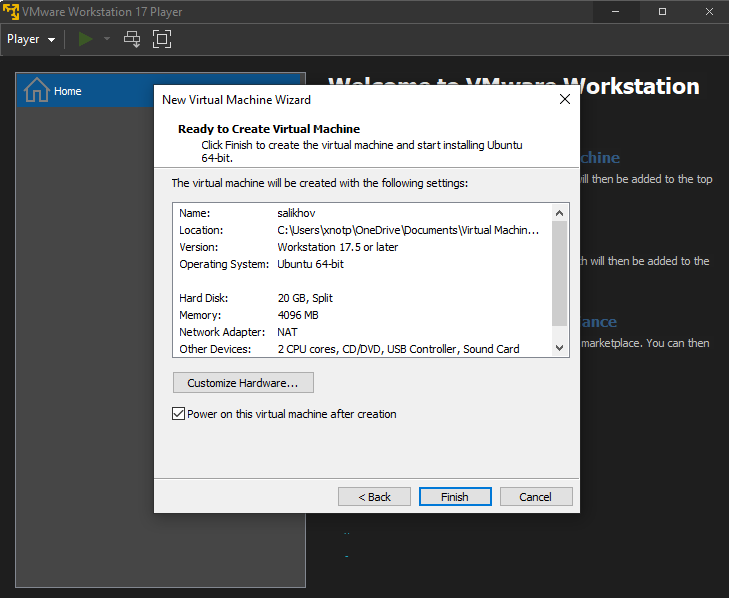

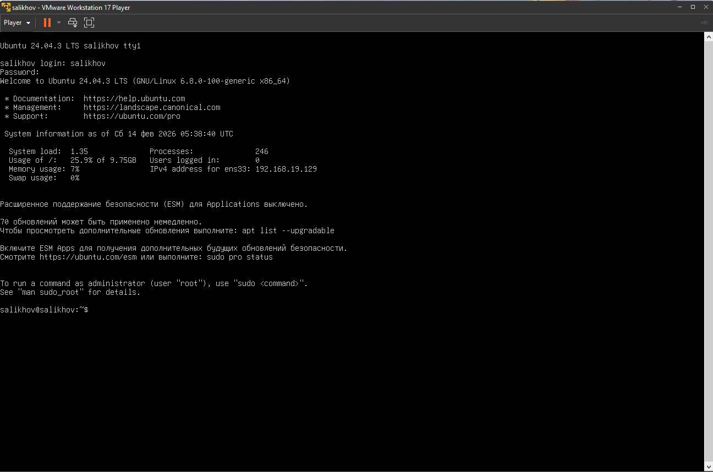

---

## 2. Информация о системе

Выполнены команды для сбора информации о системе. Результат сохранён в `~/report/01-system.txt`.

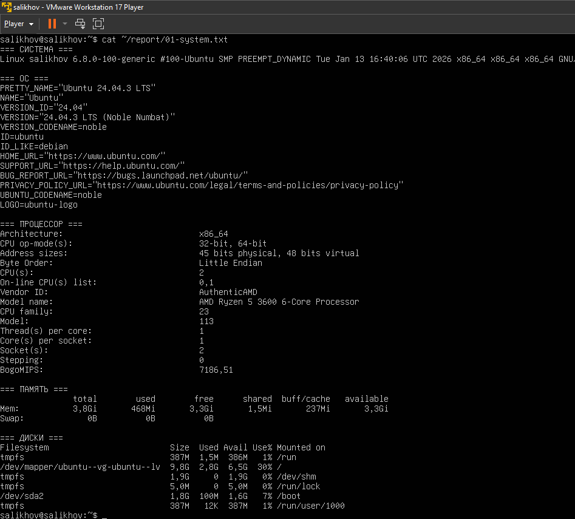

---

## 3. Сеть: IP-адрес и открытые порты

- IP-адрес: 192.168.19.129
- SSH прослушивается на 22 порту 
- Результат сохранён в `~/report/02-network.txt`.

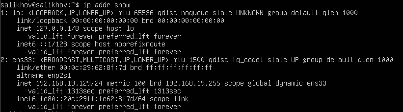

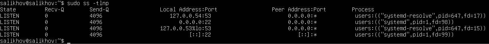

---

## 4. Сервис SSH

Проверен статус и порт сервиса SSH. Результат сохранён в `~/report/03-ssh.txt`.

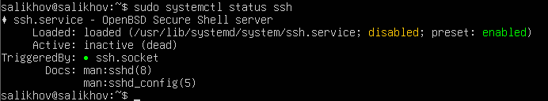

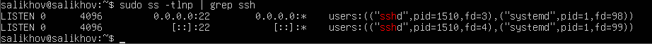

---

## 5. Пользователи и группы

Выведена информация о пользователях системы. Создан пользователь `boardy` и добавлен в группу `sudo`. Результат сохранён в `~/report/04-users.txt`.

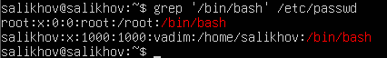

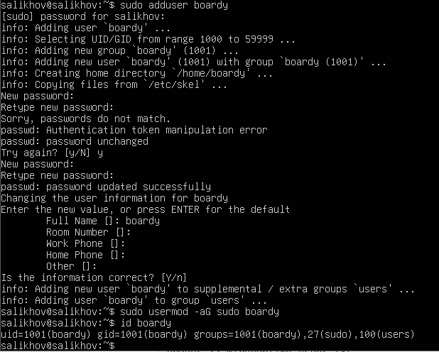

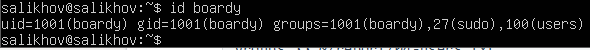

---

## 6. Дерево каталогов

Изучена структура файловой системы. Результат сохранён в `~/report/05-tree.txt`.

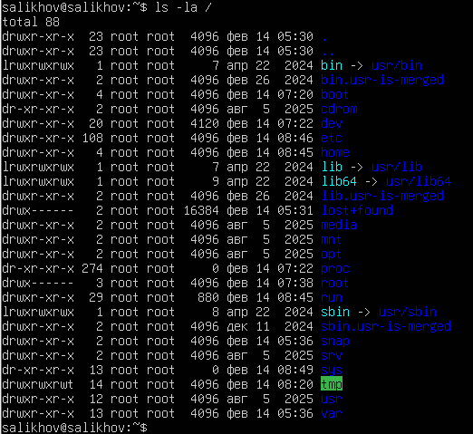

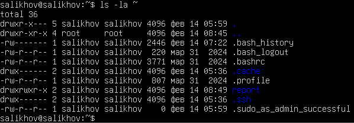

---

## 7. Права доступа

Проверены права на ключевые каталоги и выполнены операции изменения прав. Результат сохранён в `~/report/06-permissions.txt`.

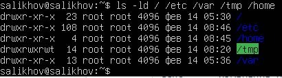

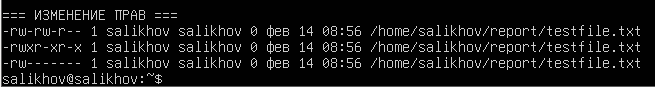

---

## 8. Установленные пакеты и сервисы

Выведен список ключевых пакетов и запущенных сервисов. Результат сохранён в `~/report/07-packages.txt`.

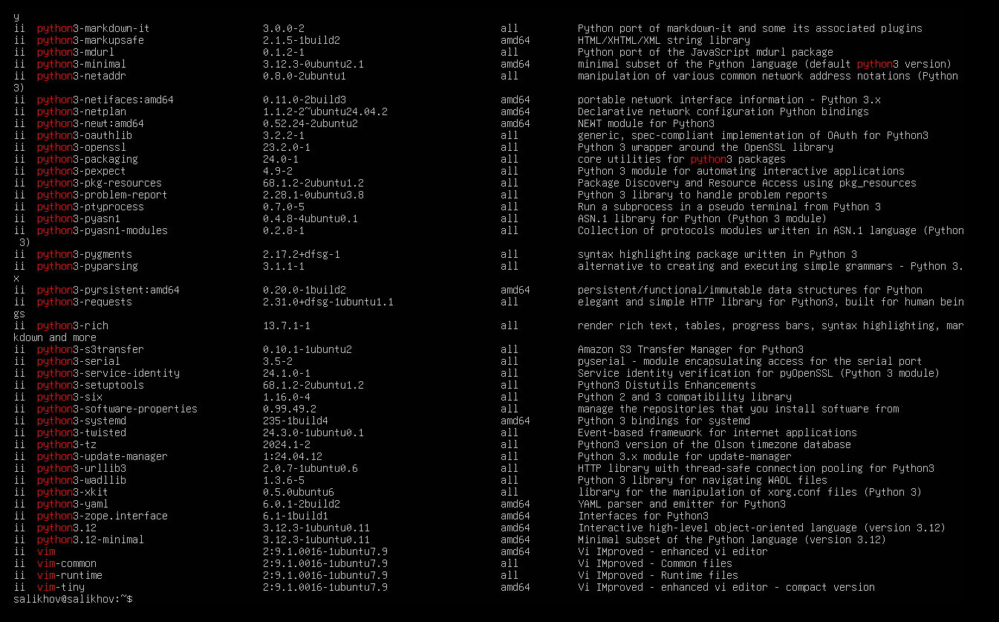

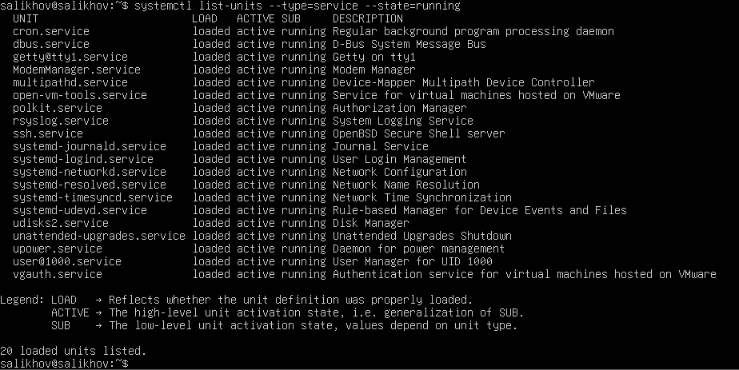

---

## 9. Конвейер и перенаправление

Выполнены комплексные команды с использованием конвейеров и перенаправления потоков. Результат сохранён в `~/report/08-pipes.txt`.

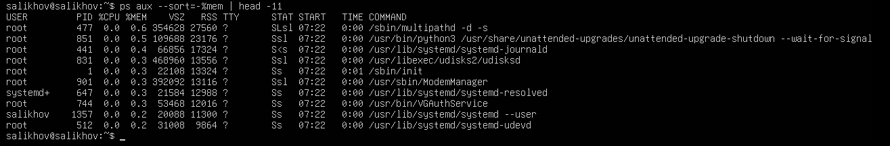

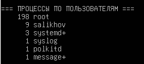

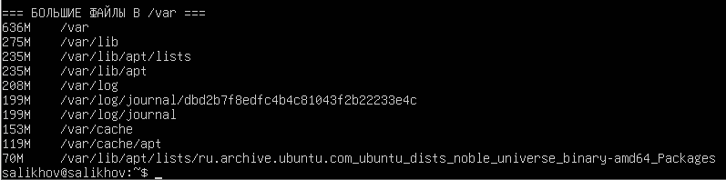

---

## 10. Итоговый отчёт

Собраны все файлы в единый отчёт `FULL-REPORT.txt`. Проверено количество строк и размер файлов.

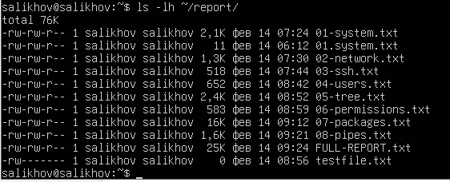

---
