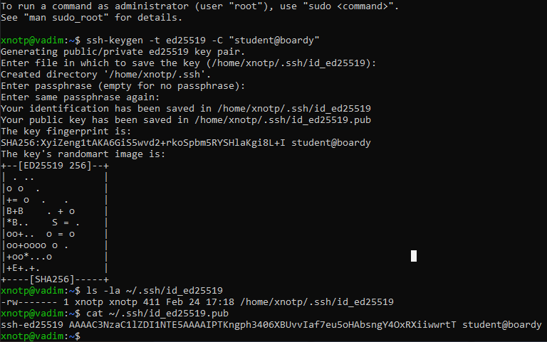
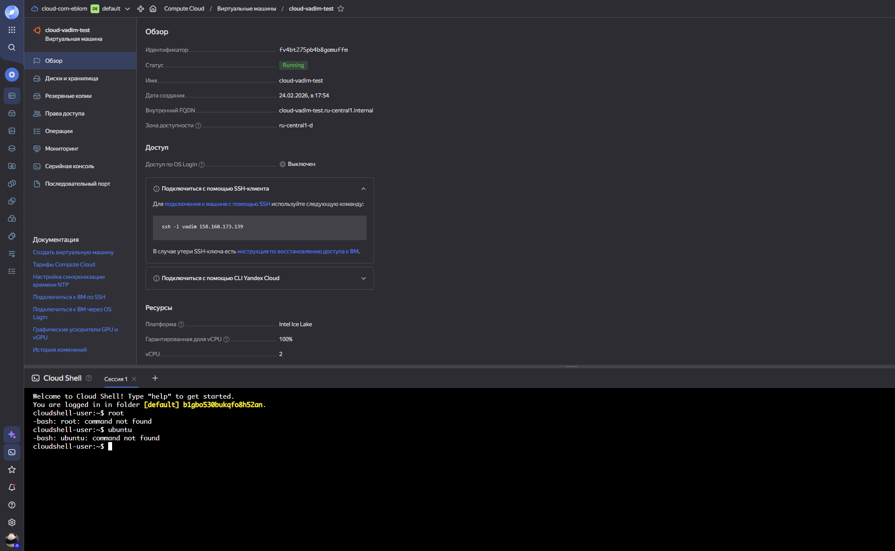
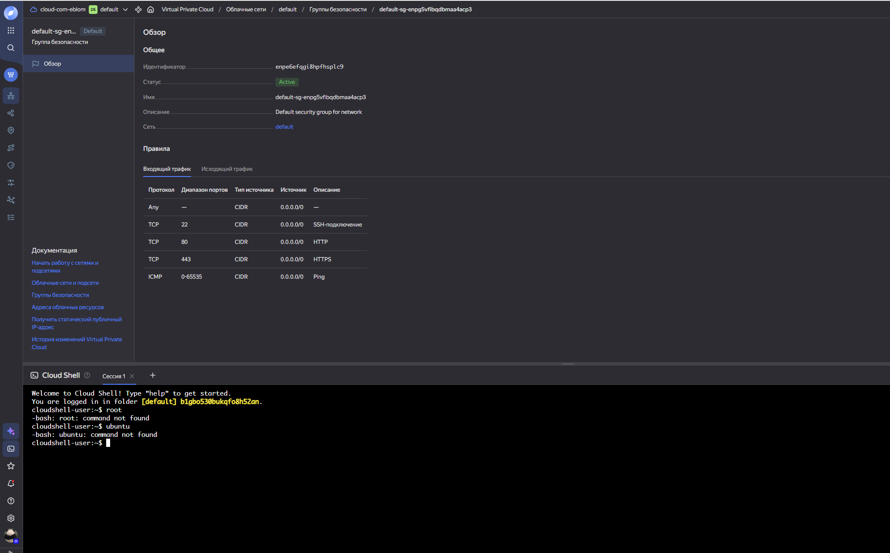
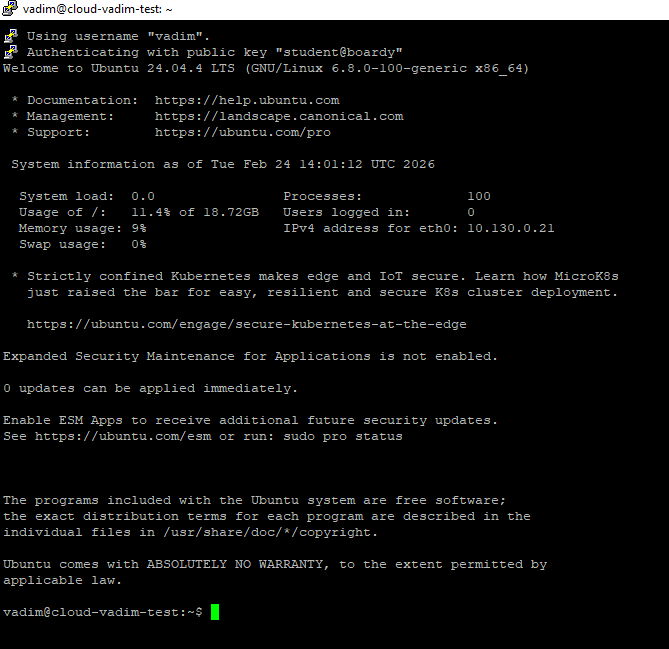
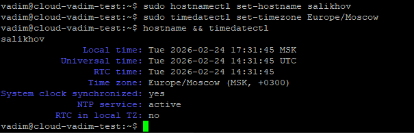
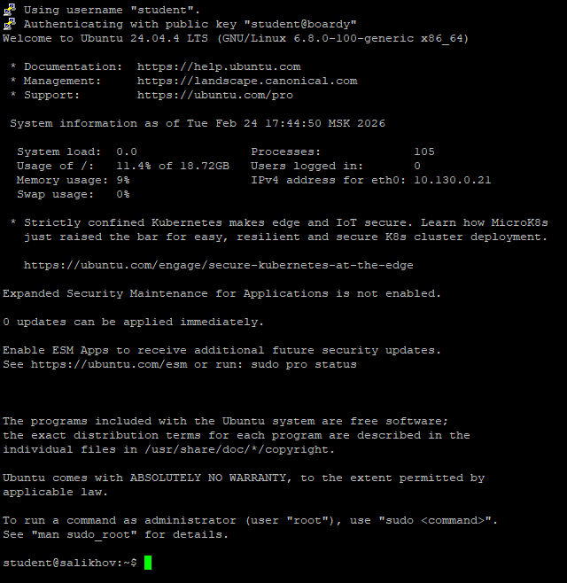
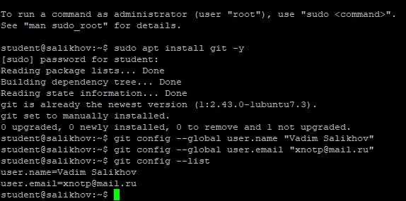
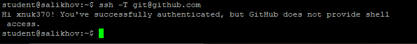
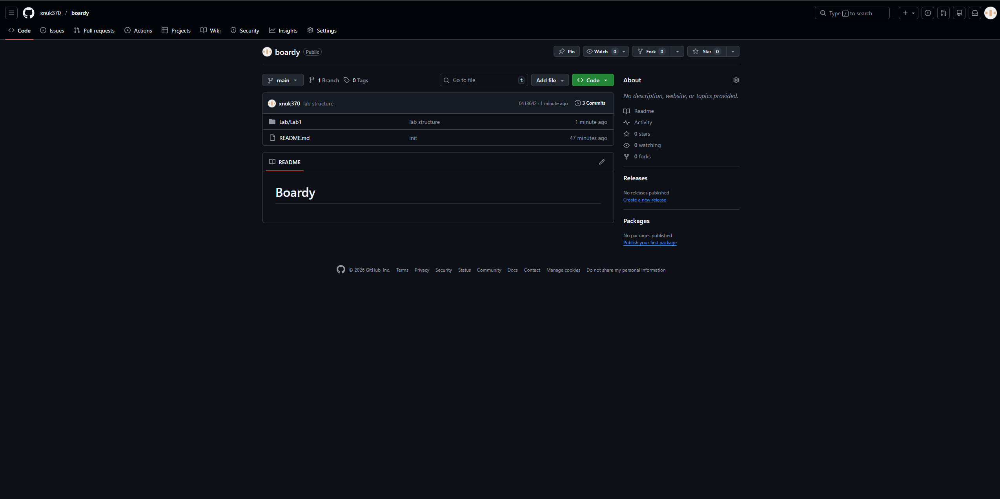
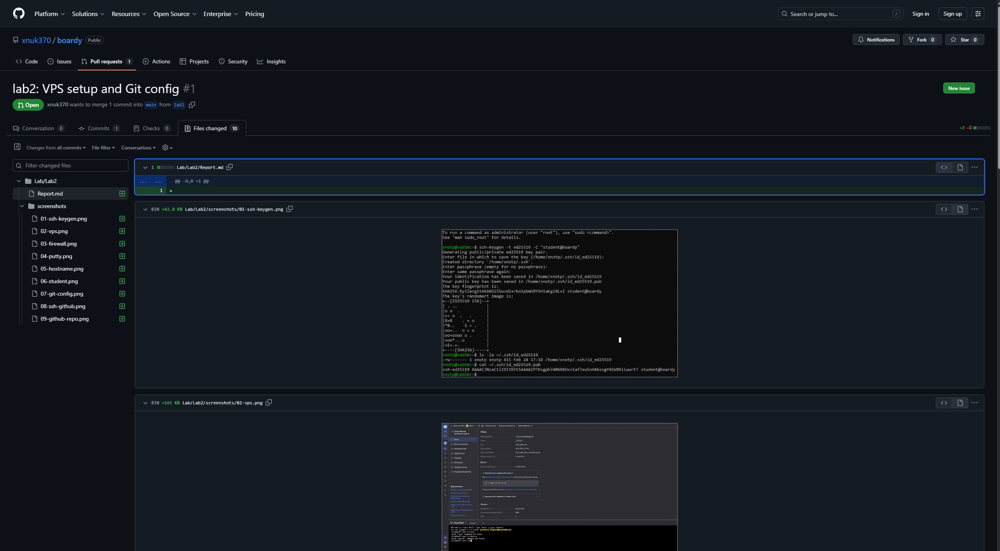

# Лабораторная работа №2: Настройка VPS, SSH и Git

**Студент:** Салихов Вадим 
**Дата выполнения:** 25.02.2026

---

## Задание 1. SSH-ключ

Сгенерирован SSH-ключ типа `ed25519` с комментарием `student@boardy`. Проверена структура файлов ключа.

---

## Задание 2. VPS и файрвол

Создана виртуальная машина в VK Cloud на базе Ubuntu 22.04 с подключением по SSH-ключу.  
Настроен сетевой файрвол с правилами:
- Входящий трафик: TCP 22 (SSH), 80 (HTTP), 443 (HTTPS), ICMP
- Исходящий трафик: TCP 22, 80, 443, ICMP

---

## Задание 3. Подключение через PuTTY

Выполнено подключение к VPS через клиент PuTTY с использованием преобразованного SSH-ключа в формате `.ppk`.

---

## Задание 4. Настройка сервера

Выполнены базовые настройки системы:
- Обновление пакетов: `apt update && apt upgrade -y`
- Установка hostname: `<фамилия>`
- Установка часового пояса: `Europe/Moscow`

---

## Задание 5. Пользователь student

Создан пользователь `student`, скопирован публичный SSH-ключ в `~/.ssh/authorized_keys`.  
Выполнено переподключение под пользователем `student`.

---

## Задание 6. Git и SSH-ключ → GitHub

Установлен Git, настроены глобальные параметры (`user.name`, `user.email`).  
Публичный SSH-ключ VPS добавлен в аккаунт GitHub.  
Выполнена проверка подключения: `ssh -T git@github.com`.

---

## Задание 7. Репозиторий и структура

Клонирован репозиторий `boardy` и создана требуемая структура каталогов:
Изменения зафиксированы и отправлены в ветку `main`.

---

## Задание 8. Ветка и Pull Request

Создана новая ветка `lab2`, добавлен отчёт `Report.md` и все скриншоты.  
Изменения отправлены на GitHub и создан Pull Request из ветки `lab2` в `main`.

---

