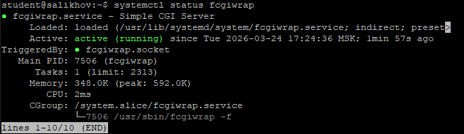
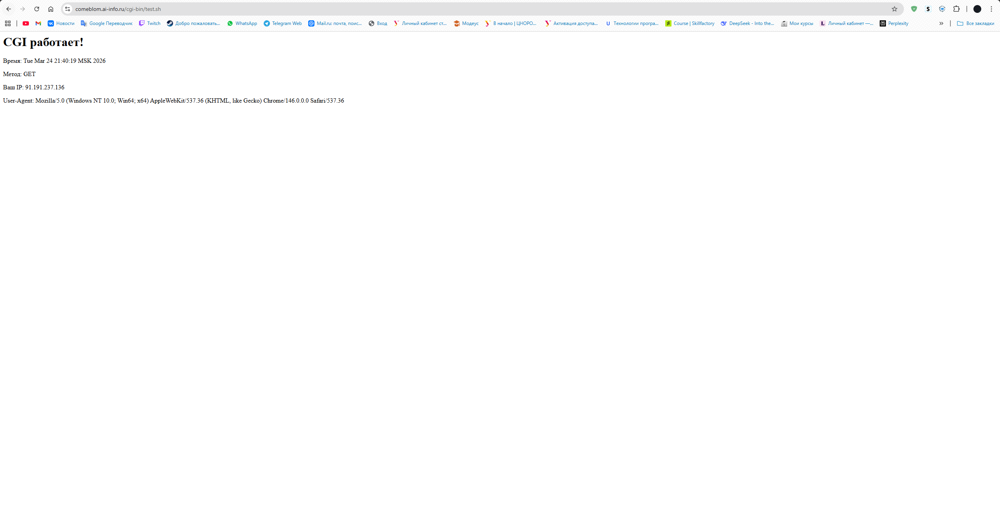
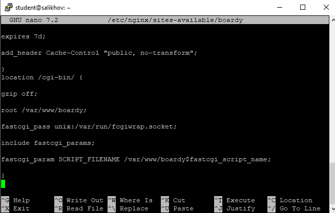
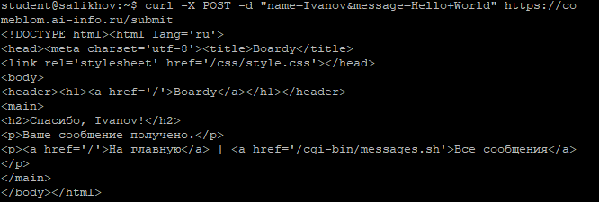
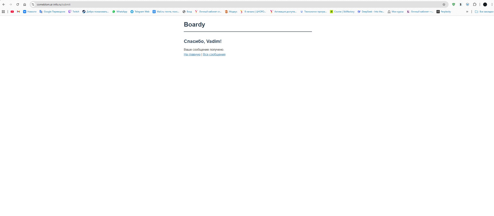
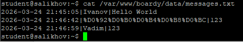
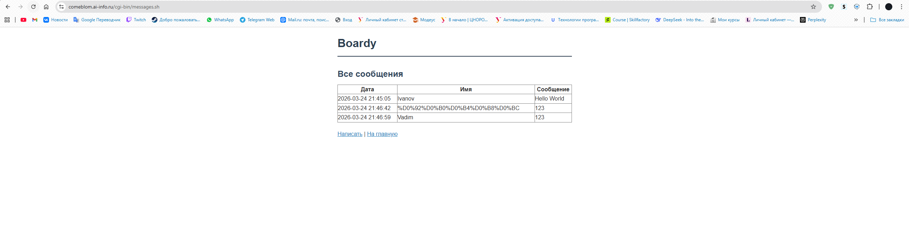
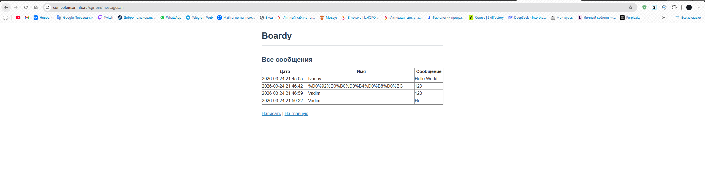

# Лабораторная работа №6: CGI-скрипты и обработка форм

**Студент:** [Салихов Вадим]  
**Дата выполнения:** 25.03.2026

---

## Часть A. CGI-скрипт

### Задание 1. Установка fcgiwrap

Установлен пакет `fcgiwrap`, обеспечивающий запуск CGI-скриптов через FastCGI. Служба активна и работает.

---

### Задание 2. Тестовый скрипт

Создан скрипт `/var/www/boardy/cgi-bin/test.sh`, который выводит:
- Текущее время
- HTTP-метод запроса
- IP-адрес клиента
- User-Agent

Скрипт успешно выполняется через браузер.

---

### Задание 3. Конфигурация Nginx

В конфигурацию виртуального хоста добавлен блок `location /cgi-bin/`.

**Объяснение директив:**
- `fastcgi_pass unix:/var/run/fcgiwrap.socket;` — передаёт запрос в сокет fcgiwrap для выполнения CGI-скрипта.
- `include fastcgi_params;` — подключает стандартные параметры FastCGI (например, `REQUEST_METHOD`, `QUERY_STRING`).
- `fastcgi_param SCRIPT_FILENAME $document_root$fastcgi_script_name;` — указывает полный путь к исполняемому скрипту.

---

## Часть B. Форма Boardy

### Задание 4. Скрипт обработки формы

Создан скрипт `submit.sh`, который:
- Читает тело POST-запроса из `stdin`
- Извлекает поля `name` и `message`
- Сохраняет данные в файл `data/messages.txt`
- Возвращает HTML-страницу с благодарностью

Проверка через `curl` подтверждает корректную работу.

---

### Задание 5. Форма в браузере

Форма на странице `feedback.html` успешно отправляется, и пользователь видит персонализированное сообщение «Спасибо, {имя}!».

---

### Задание 6. Данные на диске

Сообщения сохраняются в файл `/var/www/boardy/data/messages.txt`. Файл содержит минимум 3 записи.

---

## Часть C. Страница сообщений

### Задание 7. Скрипт вывода сообщений

Создан скрипт `messages.sh`, который читает `messages.txt` и генерирует HTML-таблицу с колонками: Имя, Сообщение, Дата.

---

### Задание 8. Полный цикл

Выполнена полная последовательность: отправка нового сообщения → переход на страницу сообщений → новое сообщение отображается в таблице.

---

## Часть D. Анализ

### Задание 9. Путь запроса

Схема обработки POST-запроса: Браузер → HTTPS (Nginx) → FastCGI (через fcgiwrap.socket) → submit.sh (stdin = тело POST) → запись в messages.txt → stdout (HTML-ответ) → Nginx → Браузер

---

### Задание 10. Теоретические вопросы

1. **Что такое CGI и какую проблему он решил в 1993 году?**  
   Common Gateway Interface (CGI) — стандарт взаимодействия веб-сервера с внешними программами. Он позволил генерировать динамический контент на основе запросов пользователей, что до этого было невозможно при использовании только статических HTML-файлов.

2. **Как CGI-скрипт получает данные POST-запроса?**  
   Тело POST-запроса передаётся скрипту через стандартный поток ввода (`stdin`), а метаданные (длина, тип) — через переменные окружения (например, `CONTENT_LENGTH`, `CONTENT_TYPE`).

3. **Почему CGI создаёт проблемы при высокой нагрузке?**  
   При каждом запросе запускается новый процесс, что приводит к высоким накладным расходам на создание процессов и потребление памяти. Это делает CGI неэффективным при большом числе одновременных запросов.

4. **Чем отличается fastcgi_pass от proxy_pass?**  
   `fastcgi_pass` используется для передачи запросов в приложения, совместимые с протоколом FastCGI (например, PHP-FPM, fcgiwrap), а `proxy_pass` — для проксирования HTTP-запросов на другой HTTP-сервер (например, бэкенд на Node.js или другой Nginx).

5. **Зачем нужен fcgiwrap, если Apache запускает CGI напрямую?**  
   Nginx не умеет запускать CGI-скрипты напрямую. `fcgiwrap` выступает адаптером: он принимает FastCGI-запросы от Nginx и запускает обычные CGI-скрипты, обеспечивая совместимость без изменения кода скриптов.